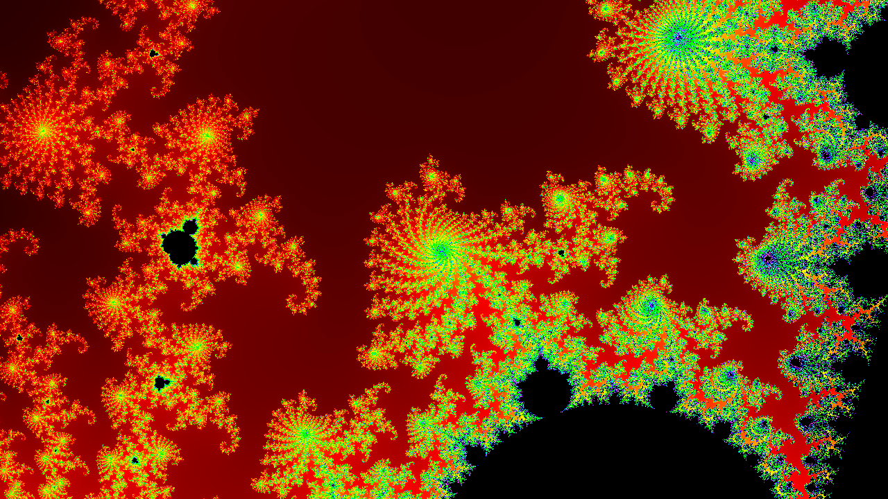
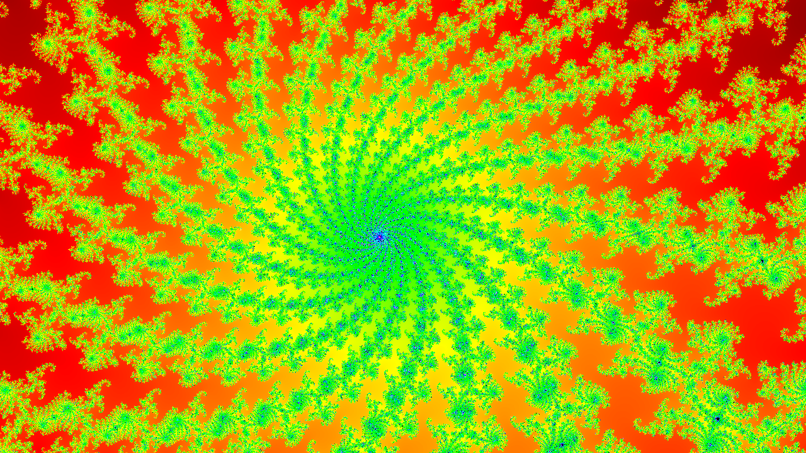
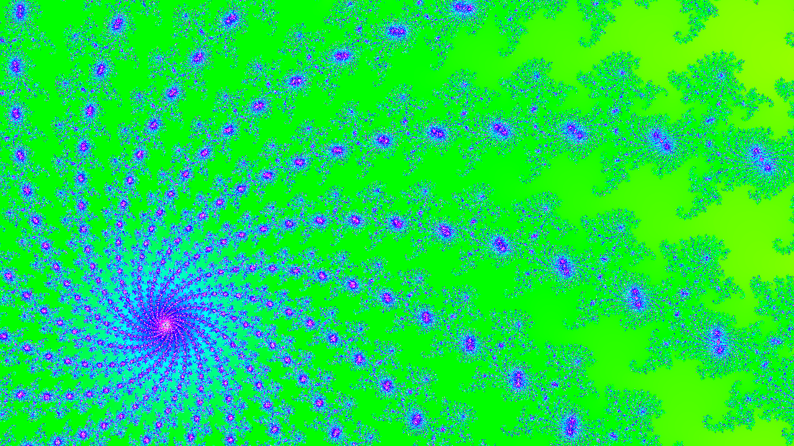
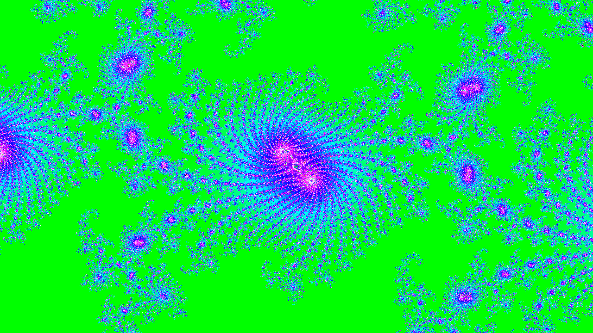

# Imaginal Snapshot

Take a snapshot of the imaginal realm.

This is a simple program for rendering the Mandelbrot set.
Mainly done for fun / as a learning exercise and meant to run with WASM/WASI.
As such, it is currently single threaded and can take some time to render.


Generated via `wasmtime --dir=. imaginal-snapshot.wasm -- -w 1280 --height 720 -c "(-0.75, 0)" -z 0.5`

The images are output as Bitmap's because this is a very simple image format.
The wikipedia article on [the BMP format](https://en.wikipedia.org/wiki/BMP_file_format)
is what was used for the bitmaps.

## Usage
The program accepts the following command line arguments:
* `-h`: help menu
* `-w`: the width in pixels of the image
* `--height`: the height of the image (note can't use `-h` bc that's the help menu)
* `-z`: how zoomed in
* `-c`: the center of the image, note this needs to be entered as a tuple if the real part is negative
    * positive real valued complex numbers can be enter like: `-c '0.25 + 0.5i'`
    * for negatives, need to enter as a tuple: `-c '(-0.75, 0.19)'`
* `-m`: the max iterations to run, if the image gets bloby, increase this param
* `-g`: this controls the color gradient, determines when the gradient starts to repeat

It will generate a bitmap image named `snapshot-n.bmp` where `n` is some number,
and a corresponding `params-n.txt` that has the params used to make the image.


## Sample Images






## Building
```
cargo build --release --target=wasm32-wasi
```
